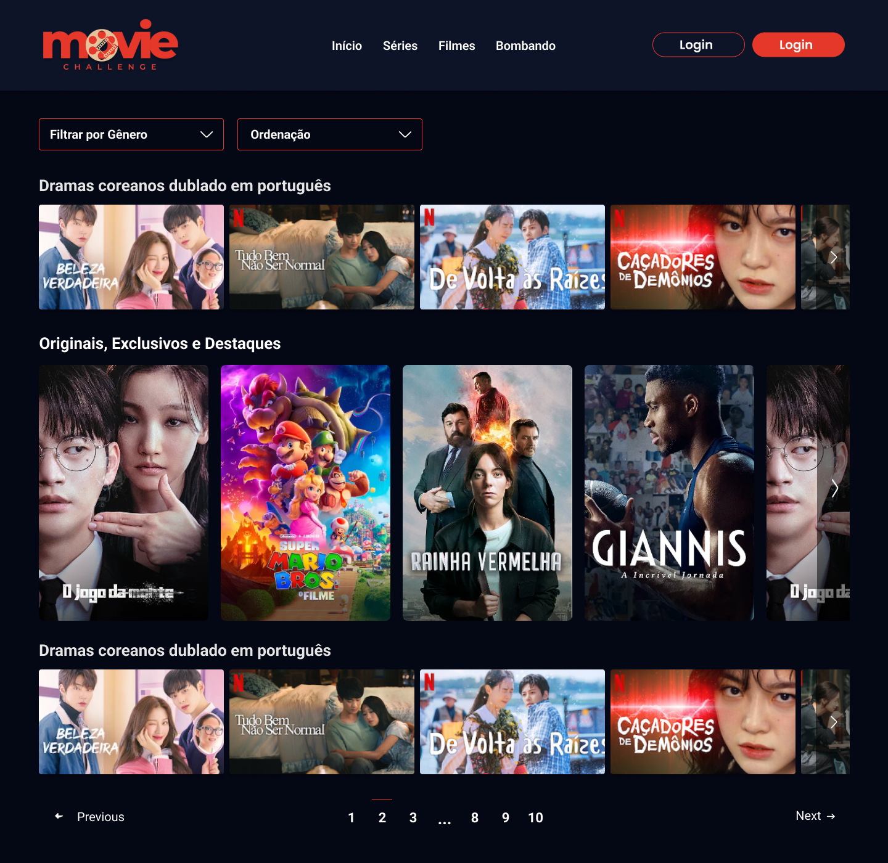
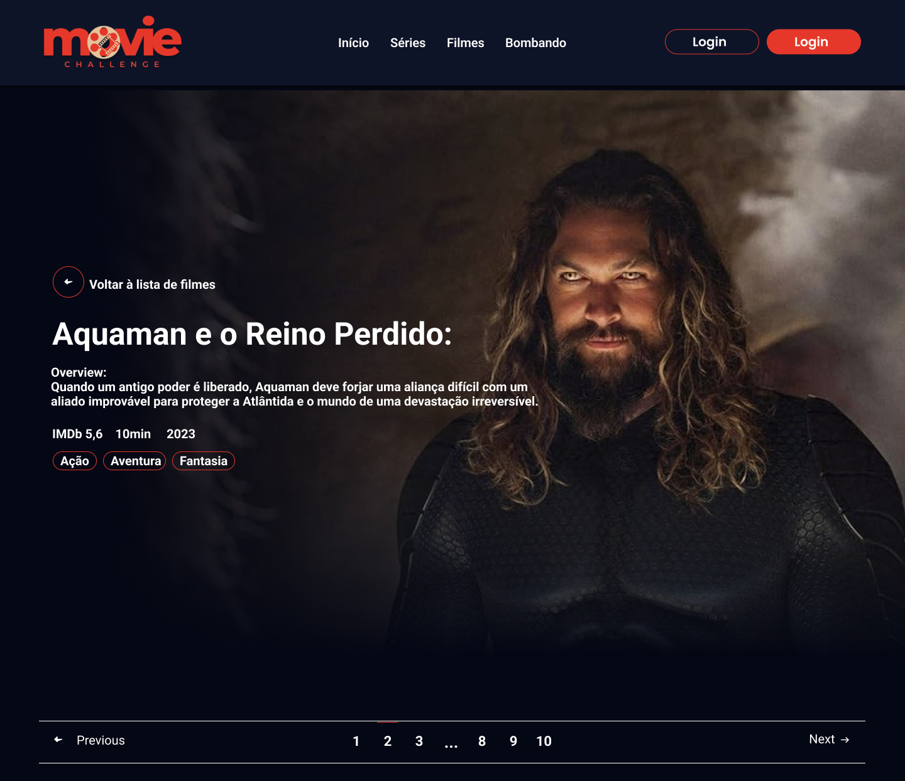

<h1>
    <a href="https://www.laboratoria.la/br">
     </a>
    <span>Projeto 04 - Movie Challenge</span>
</h1>


## 📝 Ferramentas utilizadas no sistema DataverseChat


- [Figma - Protótipo de navegação](https://www.figma.com/proto/8Er9sIX4Oj8yzqbJ4Ca2ZN/SAP012---Movie-Challenge?type=design&node-id=1-2&t=BbryAJPv3GMfIDgC-1&scaling=min-zoom&page-id=0%3A1&starting-point-node-id=1%3A2&mode=design)
- [Figma - Protótipo do projeto](https://www.figma.com/file/8Er9sIX4Oj8yzqbJ4Ca2ZN/SAP012---Movie-Challenge?type=design&node-id=28%3A117&mode=design&t=QWM37v9alEhFhznY-1)


<table>
  <thead>
    <tr align="left">
      <th>Nº</th>
      <th>Status</th>
      <th>Etapas</th>
      <th>Etapas do Desenvolvimento do Projeto</th>
    </tr>
  </thead>
  <tbody align="left">
    <tr>
      <td>01</td>
      <td></td>
      <td>Marco 01 - Configuração do projeto</td>
      <td align="center">
        <a href="https://github.com/elizabetefabri/SAP012-movie-challenge-fw/" target="_blank">
           
        </a>
      </td>
    </tr>
    <!-- <tr>
      <td>02</td>
      <td></td>
      <td>Marco 02 - Lista de Filmes</td>
      <td align="center">
        <a href="" target="_blank">
           
        </a>
      </td>
    </tr>
    <tr>
      <td>03</td>
      <td></td>
      <td>Marco 03 - Lista de filmes paginada</td>
      <td align="center">
        <a href="" target="_blank">
           
        </a>
      </td>
    </tr>
    <tr>
      <td>04</td>
      <td></td>
      <td>Marco 04 - Filtrar e Ordenar</td>
      <td align="center">
        <a href="" target="_blank">
           
        </a>
      </td>
    </tr>
    <tr>
      <td>03</td>
      <td></td>
      <td>Marco 05 - Detalhes do Filme</td>
      <td align="center">
        <a href="" target="_blank">
           
        </a>
      </td>
    </tr> -->
    </tbody>
  <tfoot>
  </tfoot>
</table>


## Instalação

```
npm install
ng serve
```
### Executando testes
```
ng test
```

## 💻 Página Home


## 💻 Página de Detalhes



<div align="center">

<br>

##### Desenvolvido por <span>Elizabete Fabri</span> ❤

</div>


